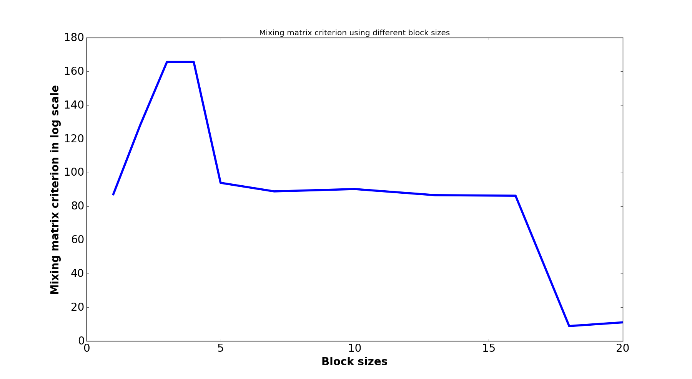
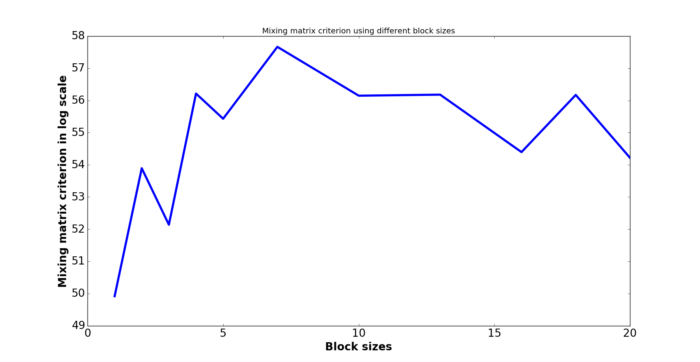

# Implementation of large scale learning methods

This package comprehends the functions implemented in the context of the workpackage 3,4 milestone 3 (implementation of large scale learning methods) of the DEDALE project. For more explanations about the theoretical aspects of the algorithms, please have a look on the related technical report.

The software implements the block GMCA algorithm (bGMCA), whose goal is to perform sparse Blind Source Separation (BSS) in the large scale regime, i.e. when a large number of sources (typically 50) needs to be estimated.


## Dependencies
### launch_bGMCA.py
Allows for a simple launch of the bGMCA algorithm, e.g. to reproduce the results of the technical report.

### bGMCA_block.py
Contains the algorithm in itself, divided into the warm-up (GMCA with blocks) and refinement stage (PALM with blocks). For each stage, a special function is implemented for the case of a non-negativity constraint in the direct domain associated with a sparsity enforced in the wavelet domain.

### BSS_Utils.py
Contains some utilitary functions to perform BSS, such as the computation of the mixing criterion or the generation of simulated data.

### Prox_SparsePositive.py
Computes the proximal operator for non-negativity in the direct domain and sparsity in the wavelet domain. Note that in this file, the PATH_WT variable has to be changed.

### pyStarlet.py
Transformations into the wavelet domain.

### sample_nmr_spectra.py
This module provides synthetic NMR spectra.


## Data
3 ways of creating simulated data to test the algorithm are proposed in the launch_bGMCA.py file: using Bernouilli-Gaussian sources, generelized Gaussian sources or realistic 1H NMR sources. It is however possible to try on your own data, for instance in adding an option dataType == 4 in the launch_bGMCA.py file. Doing so, you must load:
* X : the data matrix
* A0 : the true mixing matrix
* S0 : the true sources
* N : the noise matrix

If you have only access to X, you can directly launch the bGMCA function (warm-up stage) followed by the PALM_NMF_MainBlock function (refinement stage). 


## Exemple: a relatively simple large scale BSS problem

```python
import launch_bGMCA as lgc


N_MC = 1
numExp = 2
ptot = 0.1
cd = 1
dataType = 1
n_sources = [20]

folderInitSave='ResultsDedale/' 
optBatch = 0
verPos = 0
blocksize = [1,2,3,4,5,7,10,13,16,18,20]

C_gmca,S,A = lgc.launch_GMCA(n_sources=n_sources,blocksize=blocksize,numExp=numExp,N_MC=N_MC,dataType=dataType,sauv=2,optBlock=optBatch,folderInitSave=folderInitSave,ptot=ptot,verPos=verPos,cd=cd)
```

### Imports
Only launch_bGMCA.py is imported, since it encompasses all the necessary files.

### Data generation parameters
More specifically, it comprehends some random data generation, which can be parametriezd as inputs of the function:
```python
N_MC = 1
```
Only one Monte Carlo experiment is performed
```python
numExp = 2
```
Used for setting the random seed for the data generation
```python
ptot = 0.1
```
Proportion of non-zero coefficients
```python
cd = 1
```
Condition number of the mixing matrix
```python
dataType = 1
```
The data is created a Bernouilli Gaussian distribution: a proportion of ptot coefficients is taken non-zeros and have a Gaussian amplitude.
```python
n_sources = [20]
```
Number of sources. 20 sources is already a quite high number of sources. Take 50+ sources for really large-scale examples.

### Parametrization of the algorithm itself
```python
folderInitSave='ResultsDedale/‘
```
Folder to write the results. It must contain 2 subfolders « data » and « matricesAS ».
```python
optBatch = 0
```
Corresponds to random choices for the blocks.
```python
verPos = 0
```
Corresponds to a simple sparsity constraint in the direct domain
```python
blocksize = [1,2,3,4,5,7,10,13,16,18,20]
```
Block sizes to be tested


### Launch of the function
```python
C_gmca,S,A = lgc.launch_GMCA(n_sources=n_sources,blocksize=blocksize,numExp=numExp,N_MC=N_MC,dataType=dataType,sauv=2,optBlock=optBatch,folderInitSave=folderInitSave,ptot=ptot,verPos=verPos,cd=cd)
```
The function outputs the mixing matrix criterion for each block size.
The A and S matrices for the last block size are also available (the matrices for all the block sizes are saved in folderInitSave)

### Output
   <p align="center">
   <a name="exp_20_src.png"></a>
   
   </p>


## Example: a more difficult case
The next examples deals with non-negative matrix factorization. The A and S matrices are assumed to be sparse in a transformed domain, while non-negative in the direct domain.

```python
N_MC = 1
numExp = 2
folderInitSave='ResultsDedale/'
optBatch = 0

dataType = 3
verPos = 1
J=2

blocksize = [1,2,3,4,5,7,10,13,16,18,20]
n_sources = [20]

C_gmca,S,A = lgc.launch_GMCA(n_sources=n_sources,blocksize=blocksize,numExp=numExp,N_MC=N_MC,dataType=dataType,sauv=2,optBlock=optBatch,folderInitSave=folderInitSave,verPos=verPos,J=J)
```

### Changes in the code
```python
dataType = 3
```
The data comes now from saved realistic sources. All the matrices are non-negative.

```python
verPos = 1
```
Enforces the non-negativity and sparsity constraint.

```python
J = 2
```
Number of wavelet scales.

### Output
   <p align="center">
   <a name="exp_20_src.png"></a>
   
   </p>


## Required packages
The software requires the following Python packages:
* numpy
* scipy.io
* scipy.linalg
* matplotlib.pyplot
* copy
* time
